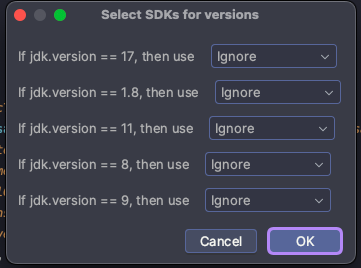

# maven module sdk helper

[Marketplace](https://plugins.jetbrains.com/plugin/23055-maven-module-sdk-helper)

It automatically set module SDKs in your maven project.

To inform this plugin which version of JDKs are required, you should
define `jdk.version`, or `maven.compiler.target`, `maven.compiler.source` in your `pom.xml` like below

```xml
<properties>
    <jdk.version>11</jdk.version>
</properties>
```

Run `SDKHelper: Match modules SDKs`(Ctrl+Shift+Cmd+M) Action, and specify the JDKs in dialog


